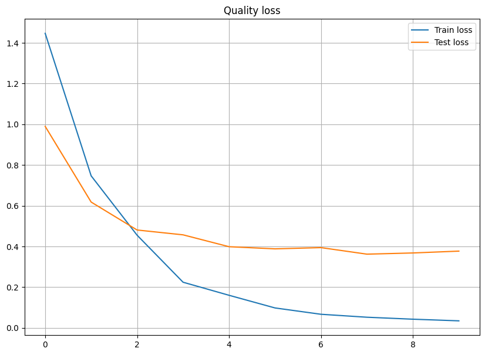
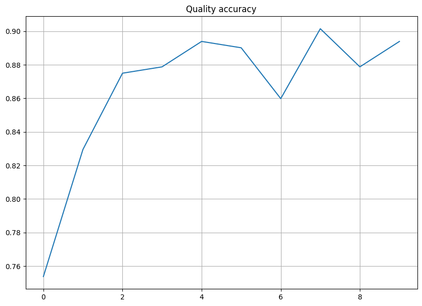
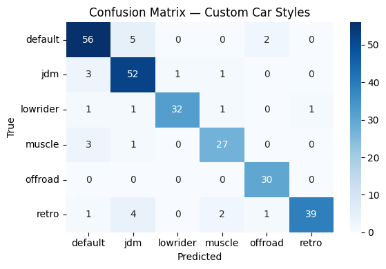
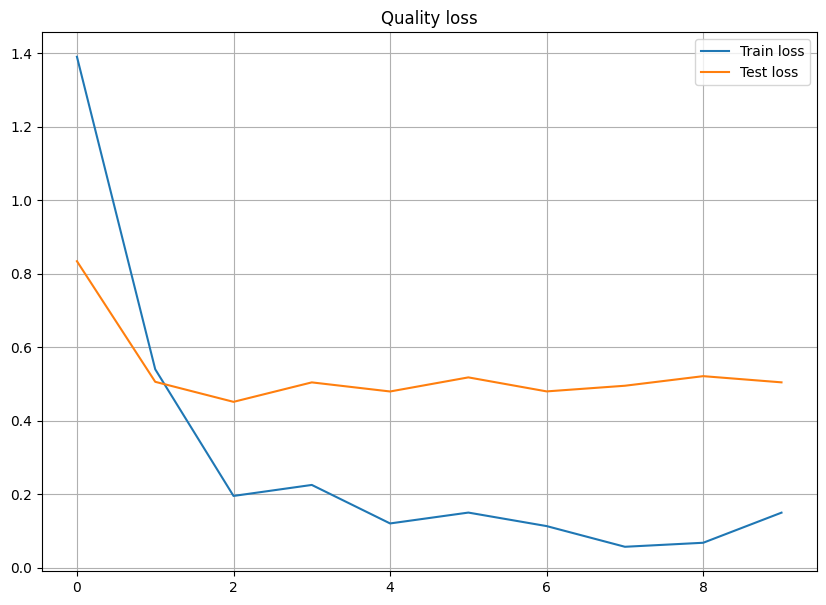
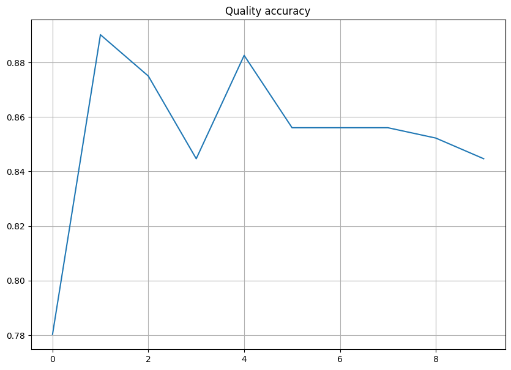
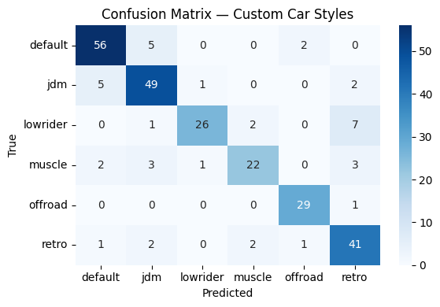

# Car Style Classifier Bot
Telegram-бот(<a href="https://t.me/TuningCarClassifierBot">Ссылка</a>), который определяет стиль кастомного автомобиля по фото. Бот принимает изображение автомобиля и возвращает предполагаемый стиль его модификации. В основе лежит модель, обученная на кастомном датасете с изображениями различных автокультур (JDM, Muscle, Offroad и др.).
<a href="https://github.com/alekchetv/Image-Bot-Classificator/blob/main/notebook.ipynb">Ссылка на ноутбук с пайплайном обучения моделей</a>
# Этапы работы над проектом
- Сбор данных (Google Images + Bing API)
- Очистка и разметка изображений
- Обучение и сравнение качества, REsNet18, Resnet50, ConvNext (PyTorch, torchvision)
- Анализ ошибок с помощью confusion matrix и f1-score
- Деплой модели в отдельный микросервис на FastApi
- Интеграция модели в Telegram-бот (aiogram v3)

# Процесс дообучения(fine-tuning): 
1. Использование архитектуры ResNet18 с измененными выходными слоями:
<table>
  <tr>
    <td></td>
    <td></td>
  </tr>
</table>

  
Матрица ошибок

  
   
  <em>Матрица ошибок Resnet18 c f1-score = 0.89</em>

 
2. Результаты дообучения ResNet50 с измененными выходными слоями:
<table>
  <tr>
    <td></td>
    <td></td>
  </tr>
</table>

  
Матрица ошибок

  
   
  <em>Матрица ошибок Resnet18 c f1-score = 0.89</em>

 

3. Результаты дообучения ConvNeXt с измененными выходными слоями:
<table>
  <tr>
    <td></td>
    <td></td>
  </tr>
</table>

  

  
Матрица ошибок

  
   
  <em>Матрица ошибок Resnet18 c f1-score = 0.89</em>

 